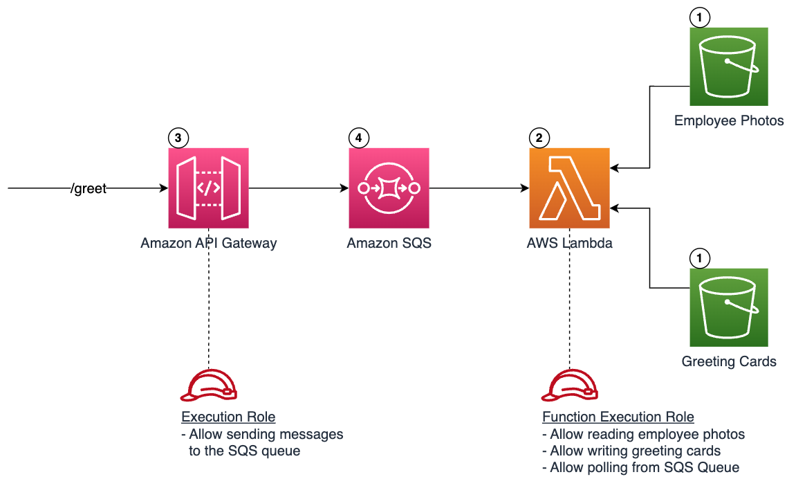
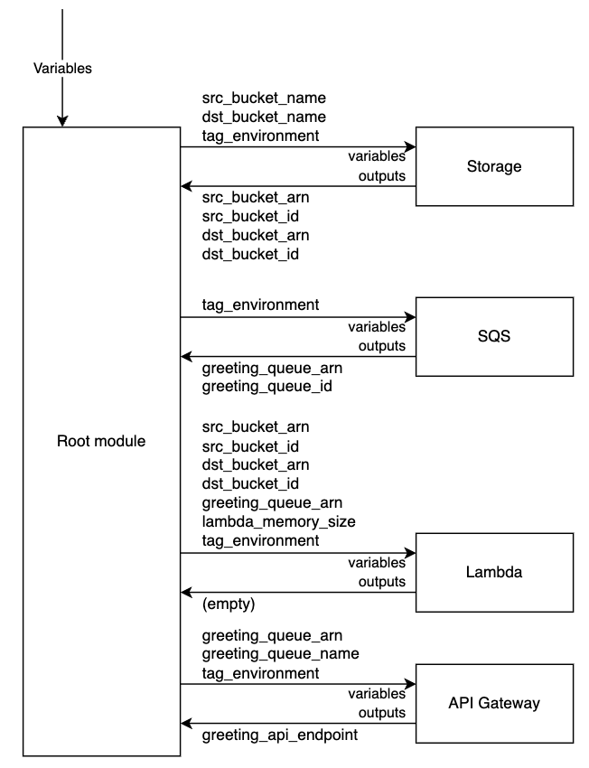

## Building Serverless Applications with Terraform 

This repository contains a sample project accompanying the guide published [here](https://serverlessland.com/content/guides/building-serverless-applications-with-terraform/01-introduction)

#### Solution architecture

#### Terraform modules layout

## License

This library is licensed under the MIT-0 License. See the LICENSE file.

